# QEMU/KVM Setup for Gaming

Why use a QEMU/KVM for Gaming in the first place?  

Simple answer is you either made the complete switch to Linux or you got tired of dual booting with Windows, but still want to play games that don't have Linux support.  

A gaming KVM has the capability to provide native performance, if not very close to it.  

The guide will cover the basics to getting a KVM running with a GPU passthrough, as well as some tweaking for better performance through CPU pinning.  

Keep in mind: this guide won't be covering a single GPU passthrough and that every situation to setting up the KVM is very unique as you could have very different configurations than my system does.  

## Table of Contents

- <a href="#specifications"> Specifications </a>
- <a href="#initial-preparations"> Initial Preparations </a>
- <a href="#configuring-your-system"> Configuring Your System </a>
  - <a href="#modifying-the-grub-file"> Modifying the grub file </a>
  - <a href="#modifying-mkinitcpio"> Modifying mkinitcpio.conf </a>
  - <a href="#creating-a-new-xorg-conf-file"> Creating a new Xorg conf file </a>
  - <a href="#more-kernel-module-parameters"> More kernel module parameters </a>
  - <a href="#final-steps-in-configuration"> Final steps in configuration </a>
- <a href="#creating-the-vm"> Creating the VM </a>
- <a href="#qemu-kvm-optimization"> QEMU KVM Optimization </a>
  - <a href="#cpu-tuning"> CPU Tuning </a>
  - <a href="#mouse-and-keyboard-passthrough"> Mouse and keyboard passthrough </a>
- <a href="#final-touches"> Final Touches </a>

## Specifications

- Motherboard: GIGABYTE X570 AORUS ELITE
- Kernel Version: 6.4.7-arch1-2
- Boot loader: GRUB
- CPU: Ryzen 7 3700x
- RAM: 32 GB
- GPU 1: NVIDIA RTX 3060Ti
- GPU 2: Sapphire Radeon R7 260x

## Initial Preparations

Before tuning, please ensure you have the proper backups on your system. I would recommend at least backing up your /home and /etc directories in case anything goes wrong.  

These packages are required to setup your KVM, each link will direct to more information.  

- <a href="https://wiki.archlinux.org/title/QEMU">qemu</a>
- <a href="https://wiki.archlinux.org/title/libvirt">libvirt</a>
- <a href="https://github.com/tianocore/tianocore.github.io/wiki/OVMF">edk2-ovmf</a>
- <a href="https://wiki.archlinux.org/title/Virt-Manager">virt-manager</a>
- <a href="https://wiki.archlinux.org/title/nftables">iptables-nft</a>
- <a href="https://wiki.archlinux.org/title/dnsmasq">dnsmasq</a>
- <a href="https://docs.mesa3d.org/index.html">mesa</a>

Use this to download all of the necessary packages.  

    sudo pacman -S qemu libvirt edk2-ovmf virt-manager iptables-nft dnsmasq mesa

**Important Note: If you are not using xfce4, KDE, or GNOME you will need to install <a href="https://wiki.archlinux.org/title/Polkit">polkit</a>. If you are, you do not need to worry about this.**  

If you don't think you have it, you can simply run this to check.  

    sudo pacman -Q polkit
    sudo systemctl status polkit

The next step is to enable virtualization and logging. You will need to activate the libvirt daemon to get both running.   

    sudo systemctl enable --now libvirtd.service

Ensure you are also in the libvirt-qemu group, 

    sudo usermod -a -G libvirt-qemu yourusername

Make sure you have a copy of Windows 10 ISO, you can get it directly from <a href="https://www.microsoft.com/en-ca/software-download/windows10ISO">Microsoft.</a>

The last thing you will need is the <a href="https://github.com/virtio-win/virtio-win-pkg-scripts/blob/master/README.md">virtio-win drivers</a> from Fedora. I recommend downloading the stable ISO image, but the latest version should work fine as well.

## Configuring your system

The next step is to configure our system by modifying/adding some configuration files in the /etc directory.  

But before we do this, we need to ensure IOMMU is enabled. For AMD it is AMD-Vi, this feature can be enabled in the **BIOS**. SVM or AMDV needs to be enabled as well.  

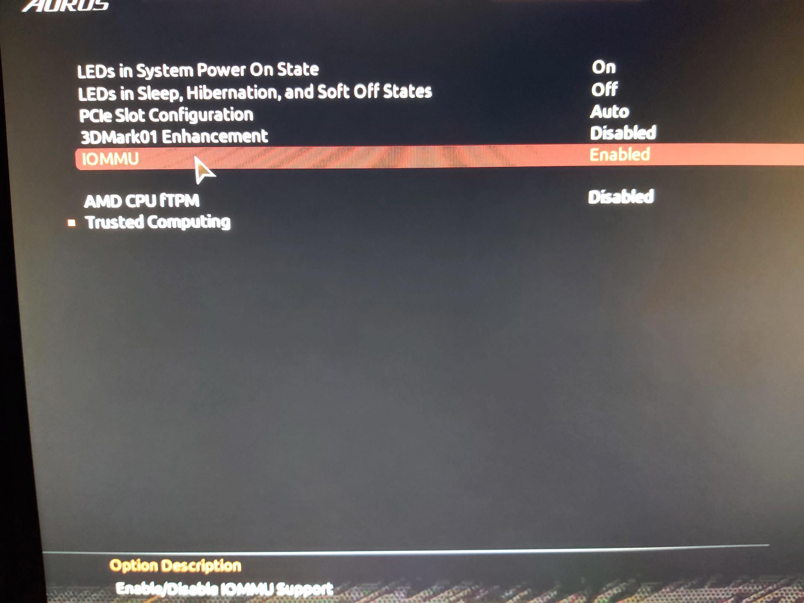  
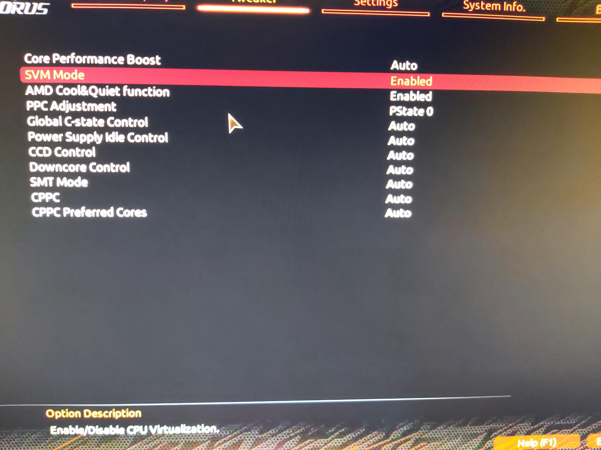

### Modifying the grub file
___

After enabling IOMMU and SVM, we need to setup some kernel parameters, since we are using grub we can easily do this in /etc/default/grub file.

In /etc/default/grub edit the GRUB_CMDLINE_LINUX_DEFAULT line and append this.

    amd_iommu=on amdgpu.modeset=1

This ensures that IOMMU is enabled after reboot and <a href="https://wiki.archlinux.org/title/kernel_mode_setting">enables kernel mode setting</a> for amdgpu early.  

### Modifying mkinitcpio
___

After setting the kernel parameters we need to edit the mkinitcpio file in /etc/mkinitcpio.conf. This will ensure that these are loaded before any boot hooks.  

    MODULES=(amdgpu radeon vfio vfio_iommu_type1 vfio_pci vfio_virqfd)

Since we want to use amdgpu make sure it is loaded **BEFORE** radeon, otherwise radeon drivers will be used before amdgpu.  

Another thing to note in the mkinitcpio.conf file is to check if the boot hooks are properly configured. Make sure modconf is in HOOKS.  

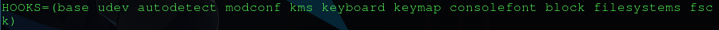  

### Creating a new Xorg conf file
___

Next is to ensure that the AMD GPU will be used as the main display device. To do this we are going to make a configuration file in /usr/share/X11/xorg.conf.d directory and will name it 10-amdgpu.conf  

**If you have any other configuration files for your other GPU e.g. 10-nvidia.conf, make sure you back that up and remove it from the folder, Xorg will detect this file and mess up your display.** 

Here is an example of my 10-amdgpu.conf file:

    Section "Device"
	    Identifier "AMD"
	    Driver	   "amdgpu"
	    BusID	   "PCI:5:0:0"
    EndSection

Replace "PCI:5:0:0" with the proper BusID after performing:

    lspci -nnk | grep -i vga

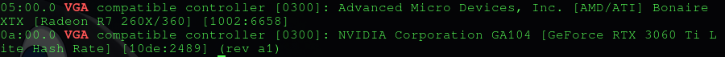

**Another important note is to double check if amdgpu driver supports your specific GPU, in this case I want to know if AMD Radeon 260x is supported.**

You can do this by comparing the device ID you got from lspci -nnk and comparing your findings using this command:  

    modinfo amdgpu | grep ^alias:

In the previous screenshot, my device id was 6658. In this next screenshot, amdgpu does support it.  

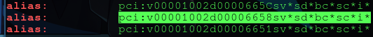  

### More kernel module parameters
___

Almost done with the configurations! Next step is to create a few files in the /etc/modprobe.d directory. There will be three files that need to be created which we'll call amdgpu.conf, radeon.conf, and vfio.conf  

*note if you have a modprobe.conf here most likely you can leave that alone unless you've blacklisted amdgpu in the file.*

From here on, you may need to do your own research on your <a href="https://en.wikipedia.org/wiki/Radeon_200_series">specific GPU model architechture</a> as we are going to setup configurations for Sea Island/Southern Island support.  

amdgpu.conf:  

    options amdgpu si_support=1
    options amdgpu cik_support=1

radeon.conf:  

    options radeon si_support=0
    options radeon cik_support=0

These enable support for both amdgpu Southern Island or Sea Island support for amdgpu driver and disables support for radeon drivers. It's perfectly fine to enable both. More can be read <a href="https://wiki.archlinux.org/title/AMDGPU">here</a>

vfio.conf:  

    options vfio-pci ids=10de:2489,10de:228b

This is the last file needed to be created which will enable us to perform a GPU passthrough on the NVIDIA GPU. Simply copy the device ID of your VGA-compatible device and Audio Device.  

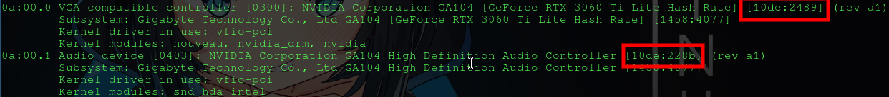

### Final steps in configuration
___

Finally rebuild the grub config and mkinitcpio file.  

    sudo grub-mkconfig -o /boot/grub/grub.cfg
    sudo mkinitcpio -P

Go ahead and reboot the system, but keep your passthrough GPU plugged in first.  

There is one last thing we need to do in the BIOs which is to change our bios splash display to the AMD GPU by changing the display to PCIe slot 2 (or whichever slot we want the main display to be). Since the AMD GPU is in PCIe slot 2, we'll use that option.  

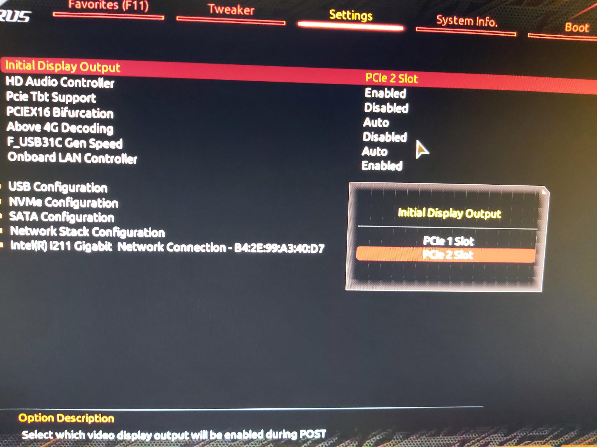

## Creating the VM

From this point forward you should have successfully passed through your GPU! Congratulations!  

To confirm that your GPU has passed through, you can run:

    dmesg | grep -i vfio
    lspci -nnk | grep -Ei "(vga|audio)" -A3

Start by activating the libvirt network:

    sudo virsh net-autostart default
    sudo virsh net-start default

This will allow us to use the default network when we first create our VM.  

Open up Virtual Machine Manager and create the Virtual Machine:  

1. We'll do local installation of the media, from here find the path to the Windows 10 image.
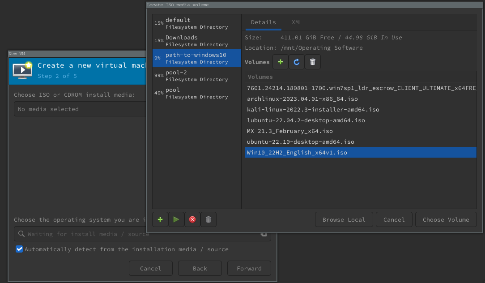  

2. Assign resources, for this guide I'll set it up with the default. I would recommend allocating 50% of your resources for now, you can scale this up later.    
3. Create storage for the system, you will need to create a pool with the path to your drive and create a volume to it. This drive can be qcow2 or raw. qcow2 has additional features, raw is a bit faster.  
  

4. Name your VM and check off "Customize configuration before install". Make sure the default is set for Network Selection.  
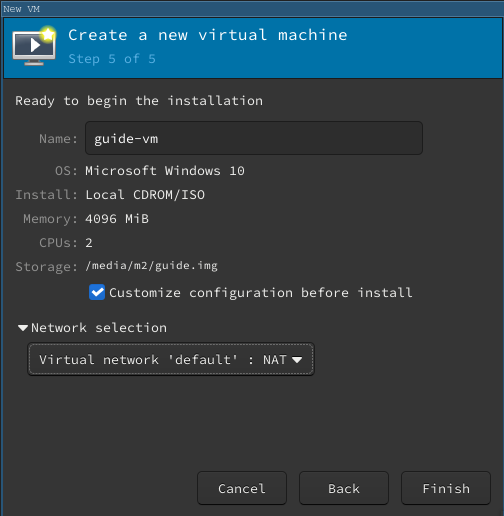  

5. In the overview panel make sure firmware is set to UEFI x86_64: /usr/share/edk2/x64/OVMF_CODE.secboot.4m.fd and click apply.  
6. Under CPUs, uncheck "Copy host CPU configuration and make sure Model is set to host-passthrough. Open Topology and manually set it up yourself if you want. I usually run 1 socket X cores 1 Threads where X is the amount of vCPUs you want to run. Click apply.  
7. Go into Sata Disk 1 and change the Disk Bus to VirtIO which is much more faster. Click apply.  
8. Go into Boot options and check Enable boot menu. You should see your VirtIO Disk and a CDROM, this is your Windows 10 Image. 
- You will need to add another CDROM which we'll use to install the virtio drivers that were downloaded. 
- Simply just add hardware, storage and create custom storage.
- Click manage and set the path to your virtio drivers and make sure it's a CDROM device.  
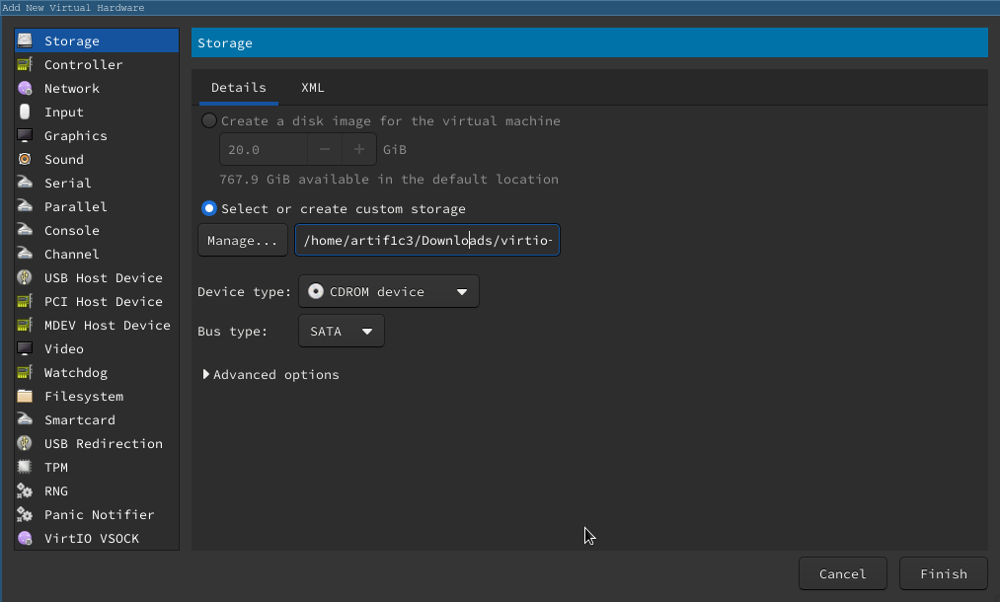  

9. For NIC change the device model to virtio. Click apply.
10.  Lastly, add additional hardware and add pcie slots for both your passthrough GPU and Audio Device.  
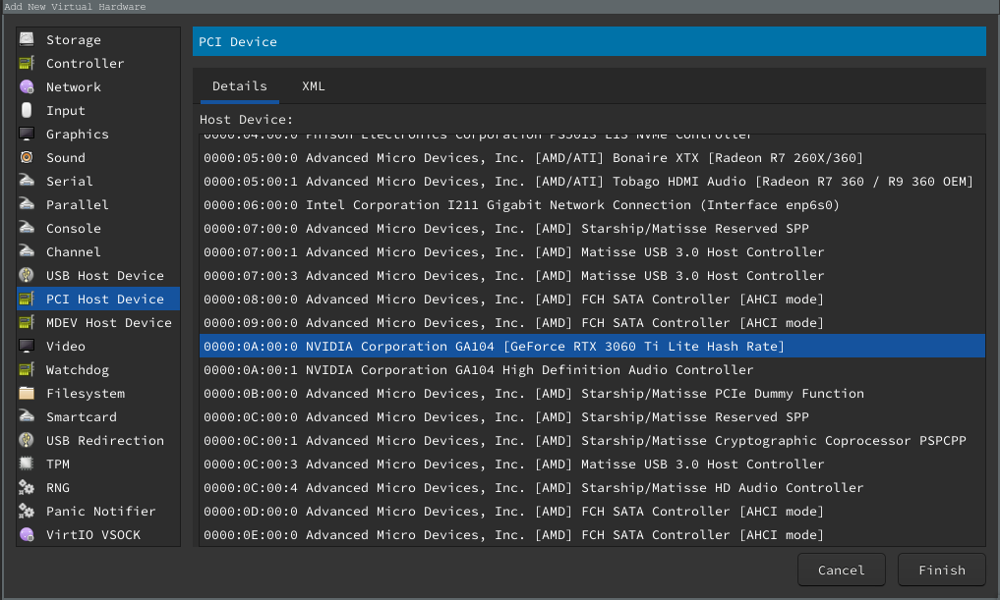  

11.   Begin Windows 10 Installation!
12.   Do a custom installation of Windows and select load driver, we will want to load the virtio drivers which should automatically detect. If it doesn't simply click browse and go to CD Drive E:/viostor/w10/amd64  
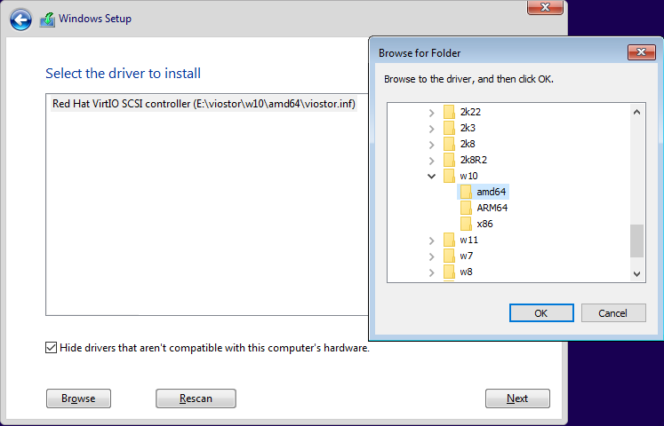

13.  Create your partitions and wait a bit for Windows 10 to install.  
14.  Once you're in Windows open the Windows Manager and go through your virtio CDROM and install the virtio-win-guest-tools, this should install the rest of your drivers into the system.  
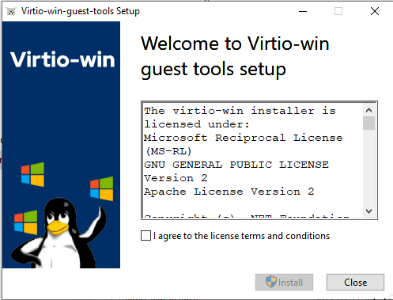  

15.  Go into Device Manager and confirm your CPU/GPU passthrough, if you see them, congratulations! You've installed a fully functional Kernel-based Virtual Machine that's ready to game on. Sometimes your VM may not detect the GPU and will see an unknown device with the Basic Display Adapter, simply install the NVIDIA drivers.  
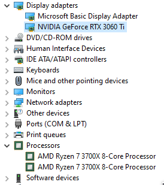  

Perform a Windows update to get the latest version of the OS and shut down the system. Set Video model from QXL to None.  
Theoretically you can unplug your main display monitor from your main display device (in this case, it's the AMD GPU) and plug it into the NVIDIA GPU which should display your KVM.  

## QEMU KVM Optimization

At this point you have successfully created a KVM, once again congratulations! The next step is to fully optimize your system and to do this, we will need to enable XML editing. To do this, go to VMM and click Edit > Preferences and check off Enable XML editting.  

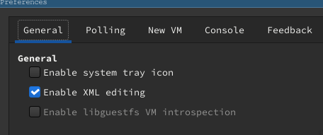

You can refer to the xml I use for my KVM <a href="./gaming.xml">here</a>.

### CPU tuning
___

CPU pinning is a great way to increase your performance drastically for your KVM. It does this by limiting which physical CPUs the vCPUs are allowed to use. Without doing so can lead to microstuttering due to L3 cache evictions. More can be read <a href="https://wiki.archlinux.org/title/PCI_passthrough_via_OVMF#CPU_pinning">here</a>.

The following command can be used to view the topology of your CPU:

    lscpu -e

An alternative is to install the <a href="https://www.open-mpi.org/projects/hwloc/">hwloc</a> package which will allow you to use the command:

    lstopo

This will display a more graphical outline on your CPU architechture, here is an example of mine:

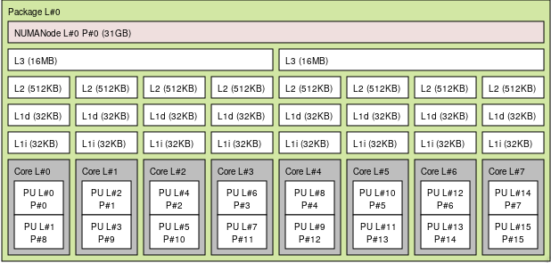

The idea is to pin specific CPUs that share the same cores under the same L3 cache e.g. CPU 4 and 12 share core 4 and would need to pin and isolate cores 4 - 7.  

Below is an example of the setup I use for my gaming KVM.  

    <vcpu placement="static">8</vcpu>
    <cputune>
        <vcpupin vcpu="0" cpuset="4"/>
        <vcpupin vcpu="1" cpuset="12"/>
        <vcpupin vcpu="2" cpuset="5"/>
        <vcpupin vcpu="3" cpuset="13"/>
        <vcpupin vcpu="4" cpuset="6"/>
        <vcpupin vcpu="5" cpuset="14"/>
        <vcpupin vcpu="6" cpuset="7"/>
        <vcpupin vcpu="7" cpuset="15"/>
    </cputune>

### Mouse and keyboard passthrough
___

For a Mouse and keyboard passthrough, we'll be using pavolelsig's <a href="https://github.com/pavolelsig/evdev_helper/blob/main/README.md">evdev_helper</a>. This will allow us to setup evdev to switch mouse/keyboard inputs between our host and KVM.  

His full guide can be found <a href="https://www.youtube.com/watch?v=4XDvHQbgujI&ab_channel=PavolElsig">here</a>.  

Start by first downloading the evdev_helper and changing it's file permissions to be executable.  

    cd ~/Downloads/evdev_helper-main/
    sudo chmod +x run_ev_helper.sh

Next we'll run evdev_helper script using

    sudo ./run_ev_helper.sh

Once you are finished, a file named evdev.txt should have been created. It will contain contents that you'll need to copy and paste into your XML.  

The default inputs to switch between host and KVM are Lctrl + Rctrl.  

## Final touches

If you try to launch a game like Battlefield, it will likely detect that you are playing on a VM.  

We'll need to hide the two things which is the CPU feature flag and CPU leaf.  

In cpu section, we'll need to disable the hypervisor feature policy:

    <cpu mode="host-passthrough" check="none" migratable="on">
        <topology sockets="1" dies="1" cores="4" threads="2"/>
        <cache mode="passthrough"/>
        <feature policy="disable" name="hypervisor"/>
    </cpu>

Under `<features>` we'll need to turn on the hidden state:

    <kvm>
      <hidden state="on"/>
    </kvm>

Since we are using an AMD CPU we will want SMT:

    <feature policy='require' name='topoext'/>

If you are using older NVIDIA drivers (before v465) you may want to add this in `<features>` to prevent device manager errors:

    <vendor_id state="on" value="0123456789AB"/>

## Extra advice

I know the guide provides steps to setting up your KVM by unplugging and replugging your monitor between your display GPU and passthrough GPU (which can get very annoying).  

My best advice is to use a KVM(Keyboard Video Mouse) or display switch you can purchase very cheaply through Amazon without having to spend a few hundred dollars on another monitor or having to replug between displays.  

<a href="https://www.amazon.ca/dp/B076ZKZLXT?psc=1&ref=ppx_yo2ov_dt_b_product_details">Link to display switch</a>

If you don't use Display Port, there are also options for HDMI display switches.